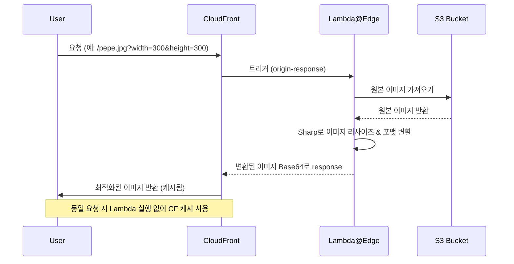

# Lambda@Edge On-Demand Image Optimization Flow

```mermaid
sequenceDiagram
    participant U as User
    participant CF as CloudFront
    participant L as Lambda@Edge
    participant S3 as S3 Bucket

    U->>CF: 요청 (예: /pepe.jpg?width=300&height=300)
    CF->>L: 트리거 (origin-response)
    L->>S3: 원본 이미지 가져오기
    S3-->>L: 원본 이미지 반환
    L->>L: Sharp로 이미지 리사이즈 & 포맷 변환
    L-->>CF: 변환된 이미지 Base64로 response
    CF->>U: 최적화된 이미지 반환 (캐시됨)
    Note over CF,U: 동일 요청 시 Lambda 실행 없이 CF 캐시 사용
```
